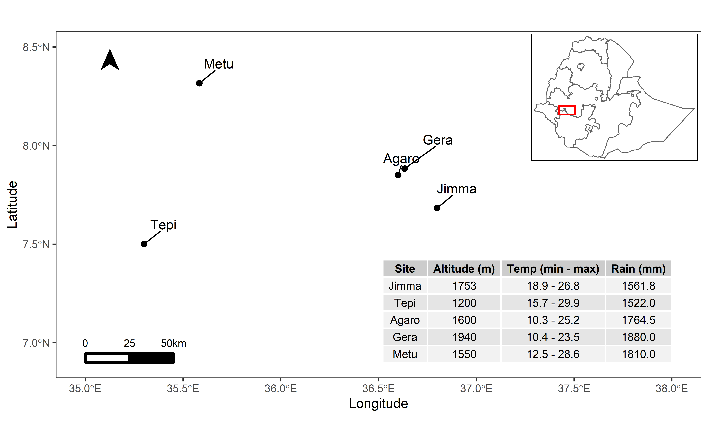

% 
  

## The research paper

This website provides easy access to commented R scripts that allows reproducing the analysis of the data from our publication.

In this work, 31 coffee genotypes were explored for their performance against the coffee leaf Rust disease at five different sites from 2016 to 2018. Descriptive and inferential statistics were used to document and model the response of 31 coffee genotypes against coffee leaf rust disease under different environments. 

## Cite this compendium

> Raza, M. M., & Del Ponte, E. M. (2021, July XX). Research Compendium: Performance of coffee varieties against leaf rust (Hemileia vastatrix) in Ethiopia: a multi-year disease monitoring and comparison of 31 genotypes. <a href="https://doi.org/10.17605/OSF.IO/XEJAZ">https://doi.org/10.17605/OSF.IO/XEJAZ</a>

